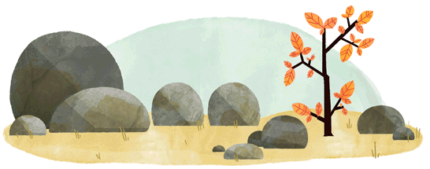

# 《 Web 包教不包会》

图：2016 北半球秋分 / Google Doodles

## 为啥写这个课程

Web 缺少一个有趣的教程。隔壁 Node 都有了，我们不能落下~ 😊

## 目录

* Lesson 0: [搭建 Web 开发环境](https://github.com/hugojing/web-lessons/tree/master/lesson0)

* Lesson 1: [使用 HTML + CSS + JavaScript 写一个最简单的 Web 页面](https://github.com/hugojing/web-lessons/tree/master/lesson1)

* Lesson 2: [使用 Babel + Webpack 编写 ECMAScript 2015 代码](https://github.com/hugojing/web-lessons/tree/master/lesson2)

* Lesson 3: [使用 Normalize.css 实现跨浏览器的默认样式标准化](https://github.com/hugojing/web-lessons/tree/master/lesson3)

* Lesson 4: [使用 Modernizr 对浏览器进行 HTML5 和 CSS3 功能检测](https://github.com/hugojing/web-lessons/tree/master/lesson4)

* Lesson 5: [使用 JavaScript 进行 DOM 操作](https://github.com/hugojing/web-lessons/tree/master/lesson5)

* …… （后面应该是 BOM 和一些常用库的课程了，比如 jQuery/sizzle ）

## 本课程特点（来自 alsotang/node-lessons 😄）

* 每一课的课程挑战如果有能力完成，则可考虑放弃阅读课程内容
* 对 Windows 用户不友好
* 内容笼统，课程重点随心所欲

## License

MIT
