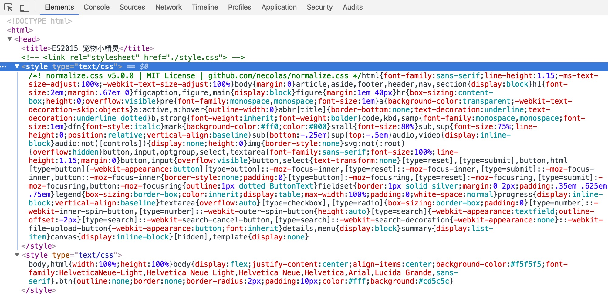

# 《使用 Normalize.css 实现跨浏览器的默认样式标准化》

## 目标

复制 lesson2 项目为 lesson3 项目，在其中修改代码。

在 JS 中引入 CSS 模块，最终打包输出为一个 JS 和 一个 CSS 文件。

当在浏览器中访问 http://localhost:8080 时，输出一个页面，在其中点击按钮、随机派出一只小精灵。

该页面需应用 Normalize.css 样式。

## 知识点

1. 学习使用 Normalize.css
2. 学习 Webpack 的 CSS 模块加载
3. 学习 Webpack 的打包功能

## 课程内容

### 为什么使用 Normalize.css

可能你注意到了，上一节课我们编写的 CSS 代码中，有这样一条：

```css
html, body {
    width: 100%;
    height: 100%;
    margin: 0;
}
```

为什么要设置 body 的 margin 为 0 ?

你可以在 Chrome 中浏览上一节课完成的网页，打开 开发者工具 > Elements 查看 body 元素的样式：

```css
body {   /* user agent stylesheet */
    display: block;
    margin: 8px;
}
```

这就是浏览器的自带样式表。

而且不同浏览器的自带样式还不尽相同，这就需要一个规范化的默认样式表，实现跨浏览器的默认样式保持一致。


### Normalize.css 实战

#### style-loader && css-loader

Normalize.css 是一个很小的 CSS 样式表文件。

所以使用起来也很简单，只需引入即可生效。

比如：

 1.简单的在 `dist/index.html` 中用 `<link>` 标签的加载能力引入 CSS 文件：

```html
  <head>
    <title>ES2015 宠物小精灵</title>
    <link rel="stylesheet" href="./normalize.css">
    <link rel="stylesheet" href="./main.css">
  </head>
```

这样当然可行，但是 normalize.css 与 style.css 两文件都很小，可以考虑打包为一个 CSS 文件，以节省一个网络请求。


推荐下面这个：

 2.使用 Webpack 的 CSS 模块加载能力

> 上节课说过，Webpack 是一个前端模块加载器 + 打包工具。这里用的就是它前端模块加载功能之一 —— CSS 模块加载。

首先需要增加 Webpack 配置信息：

安装所需要的 loaders：

```bash
$ npm i css-loader style-loader --save-dev
```

修改 `webpack.config.js`文件，对 CSS 模块使用 style-loader 和 css-loader 来加载：

```js
module: {
    loaders: [
        {
            test: /\.js$/,
            loader: 'babel',
            include: [SRC_PATH]
        },
        {
            test: /\.css$/,
            loader: 'style!css'
        }
    ]
},
// ...
```

剪切 `dist/main.css` 为 `src/main.css`，去掉 `margin: 0` 这一行：

```css
html, body {
    width: 100%;
    height: 100%;
    /*margin: 0;*/
}
```

通过 npm 安装 Normalize.css:

```bash
$ npm i normalize.css --save
```

修改 `src/main.js` 文件，增加 CSS 文件的引入：

```js
import 'normalize.css'
import './main.css'
import pokemonGif from 'pokemon-gif'
// ...
```

当然也要适时修改 `dist/index.html`，注释掉一行:

```html
<head>
  <title>ES2015 宠物小精灵</title>
  <!-- <link rel="stylesheet" href="./main.css"> -->
</head>
```

使用 `npm run build` 命令进行打包，然后使用 `npm run serve` 启动服务。

查看页面即可发现 body 的 margin 已经为 0，说明 Normalize.css 生效。

不过，咱们的两个 CSS 文件都已经打包到 JS 文件中去了，稍稍观察即可发现：



竟然是由 JS 动态地创建 `<style>` 标签来加载的，而且还是两个 `<style>` 标签！


网络请求次数虽然少了，但又带来了多个 `<style>` 标签，所以需要改善一下。


#### extract-text-webpack-plugin

extract-text-webpack-plugin 可以将多个 CSS 文件合并为一个，并输出为独立的 CSS 文件。

首先安装插件：

```bash
$ npm i extract-text-webpack-plugin --save-dev
```

修改 `webpack.config.js` 文件，对 CSS 模块增加插件：

```js
// ...
const ExtractTextPlugin = require("extract-text-webpack-plugin")
// ...

module: {
    loaders: [
        {
            test: /\.js$/,
            loader: 'babel',
            include: [SRC_PATH]
        },
        {
            test: /\.css$/,
            loader: ExtractTextPlugin.extract('style', 'css')
        }
    ]
},

// ...

plugins: [
    new ExtractTextPlugin("styles.css"),
    // ...
]
```

这样，就能把 CSS 模块单独提取出来，打成一个单独的文件 `dist/styles.css`

快去 `dist/index.html` 中引入该文件：

```html
<head>
  <title>ES2015 宠物小精灵</title>
  <link rel="stylesheet" href="./styles.css">
</head>
```

打包，启动服务。

查看页面，终于达到了满意的效果：

把 Normalize.css 与自己写的样式文件打包到一块了，节省了不必要的静态资源网络请求次数，又避免走向另一个极端比如“ CSS 打进 JS，JS 为每一个样式表创建一个 `<style>` 标签” 这样的奇葩做法。

> 最后说一句：上一节课很多人反映要系统讲一下 Webpack，我觉得没有太大的必要，尤其对于萌新而言。只能看到冰山一角
并不是坏事，随着视野的打开慢慢学到 Webpack 的各个部分，比一口吃个大胖子要好。当然，部分人确实有能力，那我推荐直接看：[《一小时包教会 —— webpack 入门指南》](http://www.cnblogs.com/vajoy/p/4650467.html)
