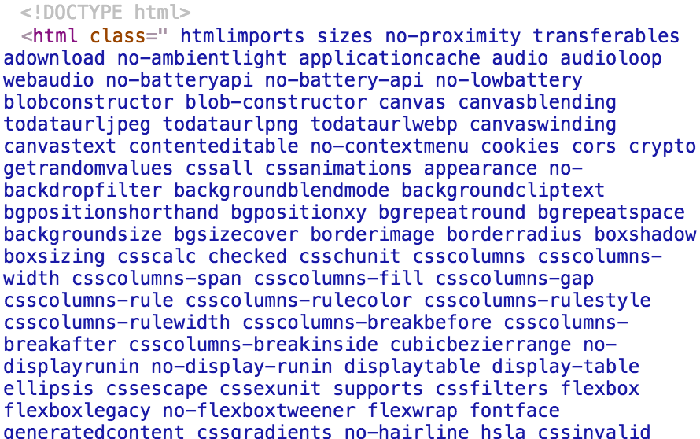
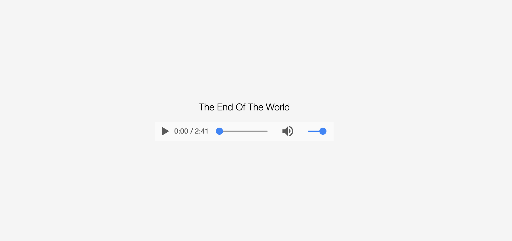

#《使用 Modernizr 对浏览器进行 HTML5 和 CSS3 功能检测》

## 目标

创建 lesson4 项目，引入 Modernizr CLI。

使用 Modernizr CLI 生成自己需要的 Modernizr 包。

使用 Modernizr 进行功能特性检测，在浏览器不支持某一特性时应用相应样式和逻辑。

当在浏览器中访问 http://localhost:8080 时，输出页面。

## 知识点

1. 学习使用 [Yarn](https://yarnpkg.com/)（新的 npm CLI client）
2. 学习使用 html-webpack-plugin 自动生成 HTML 文件
3. 学习 Modernizr CLI 的用法
4. 学习使用 url-loader 与 file-loader 实现音频、图像、视频等模块的加载
5. 学习 Modernizr 的用法

## 课程内容

### 为什么使用 Modernizr

在进行前端开发时，想用一些浏览器的新特性，却不确定用户的浏览器是否支持。

这时便需要进行手工检测来判断，进而给出不同的处理。

使用 Modernizr，可以方便地进行特性检测。从这些手工检测中解放出来，腾出力气来做好优雅降级。

而且 Modernizr 可订制化，列出一个 JSON 格式的特性清单，便可以打出一个你所需要的最小的包。

### Modernizr 实战

#### html-webpack-plugin

上节课有用到 Webpack 的插件：extract-text-webpack-plugin，这次首先介绍一个新的小插件：html-webpack-plugin. 主要功能是自动生成 HTML 文件。


使用 Yarn（新的 npm CLI client）初始化项目：

```bash
$ yarn init  # 替代原 npm init
```

沿用上一节课的项目结构，创建需要用到的文件目录。

添加 html-webpack-plugin 到项目：

```bash
$ yarn add --dev html-webpack-plugin # 替代原 npm i --save-dev html-webpack-plugin
```

修改和添加 Webpack config 如下:

```js
const HtmlWebpackPlugin = require('html-webpack-plugin')
// ...
output: {
        path: DIST_PATH,
        filename: 'scripts.js',
        publicPath: './'  // 由原 / 改为 ./ , 否则 html-webpack-plugin 链接到的 JS/CSS 文件路径不对
},
plugins: [
    // ...
    new HtmlWebpackPlugin({
        title: 'Modernizr 实战',
        template: path.resolve(SRC_PATH, 'index.html')
    }),
    // ...
]
```

这段配置是说以 src/index.html 为模板，创建一个 title 为 `Modernizr 实战` 的 html 文件，并输出到 output 输出目录。

如果一同输出的有 JS 和 CSS 文件，它会自己写好 `<script src>` 和 `<link>` 到所输出的 html 文件中。

新增 src/index.html 文件，编写如下：

```html
<!DOCTYPE html>
<html class="no-audio">
<head>
    <title>Modernizr 实战</title>
</head>
<body>
    <div id="music">
        <p>The End Of The World</p>
    </div>
</body>
</html>
```

这样一来，打包时就会自动生成符合需要的 dist/index.html 文件。

#### Modernizr CLI

添加 Modernizr CLI 到项目中：

```bash
$ yarn add modernizr  # 替代原 npm i modernizr --save
```

新增 modernizr CLI 的 generate 命令到 package.json ，可根据指定的 config json 文件生成自订制的 modernizr.js 文件。

```json
"scripts": {
    "modernizr": "modernizr -c node_modules/modernizr/lib/config-all.json"
}
```

执行 modernizr CLI 的 generate 命令，生成 modernizr.js 文件：

```bash
$ yarn run modernizr # 替代原 npm run modernizr
# Modernizr build saved to xxxxx/lesson4/modernizr.js
```

为了代码中方便使用，可在 webpack.config.js 的 config.resolve.alias 中配置别名：

```js
alias: {
    'modernizr': path.resolve(ROOT_PATH, 'modernizr.js')
}
```

#### url-loader && file-loader

在 src/main.js 文件中编写代码，引入需要加载的一些前端模块（CSS、MP3）:

```js
import 'normalize.css' // 不是合法的 ES2015 Modules 写法，由 babel 转为 `require('normalize.css')`，再由 Webpack 实现 CSS 加载
import './main.css' // 同上，会转为 `require('normalize.css')
import musicUrl from './The_End_Of_The_World.mp3' // 同上，会转为 `const musicUrl = require('./The_End_Of_The_World.mp3')`
```

代码中的 import(require) 都是 Webpack 接管的，所以 The_End_Of_The_World.mp3 这个音频文件得让 Webpack 来加载它。这就要用到两个新的 loader: `url-loader` 和 `file-loader` .

添加到项目中：

```bash
$ yarn add --dev url-loader file-loader
```

然后添加 Webpack config:

```js
module: {
    loaders: [
        // ...
        {
            test: /\.mp3$/,
            loader: 'url?limit=1024&name=[hash].[ext]'
        }
    ]
},
```

> url?limit=1024&name=[hash].[ext] 意思是使用 url-loader 来加载，小于 1024k 的打成 Base64，大于的复制文件到 output 输出目录、并命名为 [hash].[ext] 的格式。

这样，JS 中 import(require) 一些 mp3 文件的时候，Webpack 就可以按照配置策略进行加载，其返回值为 Base64 值或者 文件的 url.

可以验证一下，`console.log(musicUrl)` 会得到类似 `/205cc6e697917a94362ed6ed99febe71.mp3` 的结果，即为加载成功。

#### Modernizr

继续编辑 src/main.js , 应该引入我们生成的自订制 modernizr 文件了。

查看 modernizr.js 文件，可以发现这个模块既不是 AMD、CMD、CommonJS 模块，也不是 ES2015 模块，更不是 UMD 模块，而是传统的 globals 库，将 modernizr 挂载在 window 上。（了解不同的模块类别，推荐阅读：[关于AMD,CMD,CommonJS及UMD规范](http://www.tuicool.com/articles/nueqi27)、[识别库的类型](https://zhongsp.gitbooks.io/typescript-handbook/content/doc/handbook/declaration%20files/Library%20Structures.html)）

由于 modernizr.js 文件是传统的 globals 库，所以执行所加载的 modernizr.js 即可，写法如下：

```js
import 'modernizr' // modernizr 即为 ./modernizr.js

```

> 注意，这虽是合法的 ES2015 Modules 写法，但实现上依然是由 babel 转为 `require('modernizr')`，再由 Webpack 实现 JS 加载的。

这样，window.Modernizr 就可用了。

打包一下：

```bash
$ yarn run build # 替代原 npm run build
```

然后启动服务：

```bash
$ yarn run serve # 替代原 npm run serve
```
打开浏览器查看开发者工具，查看 Elements：



可见，直接加载执行 Modernizr，它不仅挂载了 window.Modernizr, 还依照检测结果给 `<html>` 标签写入了对应的 CSS class 名，例如 `cookies cors crypto cssall no-backdropfilter audio` 等。这样，开发者就可以写两种 CSS 样式（比如 `.audio body` 与 `.no-audio body`），以应对两种可能的情况（某一功能的有或无）。

于是，这样编写 src/main.css :

```css
html, body {
    width: 100%;
    height: 100%;
}
body {
    display: flex;
    justify-content: center;
    align-items: center;
    font-family: "HelveticaNeue-Light", "Helvetica Neue Light", "Helvetica Neue", Helvetica, Arial, "Lucida Grande", sans-serif;
}
.no-audio body {
    color: #fff;
    background-color: #000;
}
.audio body {
    color: #000;
    background-color: whitesmoke;
}
.no-audio #music {
    width: 600px;
    text-align: left;
}
.audio #music {
    width: 300px;
    text-align: center;
}
```

JS 中也可以获取检测结果，例如：

```js
Modernizr.audio // turn or false
```

于是，这样编写 src/main.js :

```js
//...
const container = document.getElementById('music')

if (Modernizr.audio) {  // Modernizr 即是 window.Modernizr
    const music = new Audio(musicUrl)
    music.controls = 'controls'
    container.appendChild(music)
} else {
    const musicIntro = document.createElement('p')
    musicIntro.textContent = '史琪特·戴维丝 1963 年演唱的《The End Of The World》（世界末日）被评为当年最受欢迎的歌曲，被无数人翻唱过，但无人能及她原唱的魅力，这首歌也是她唯一的传世之作。'
    container.appendChild(musicIntro)
}
```

别忘了打包和启动服务。

#### 最终效果

在支持 HTML5 Audio 的浏览器中：



在不支持 HTML5 Audio 的浏览器中：


感谢 Modernizr，给了我们一个更优雅的检测浏览器新特性的方式。
